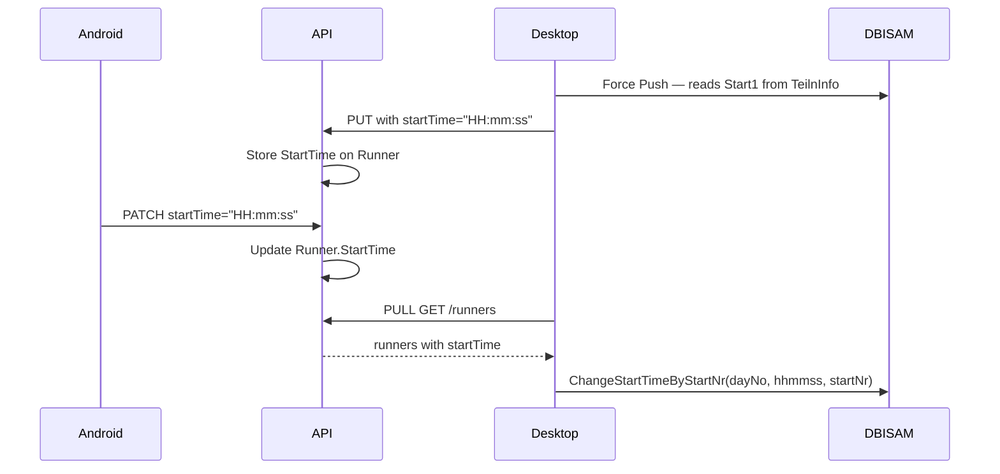

# Lookup Tables and StartTime

## Part 1: Class/Club Lookup Tables

### What changes

- Remove `ClassName`/`ClubName` columns from `Runners` table → new `Classes (Id, Name)` and `Clubs (Id, Name)` tables
- `Runner` keeps only `ClassId`/`ClubId` (plain ints, no FK constraint — avoids insert ordering issues)
- GET resolves names from lookup dicts in C#
- PUT (desktop) upserts `Classes`/`Clubs`; PATCH (Android) only sends IDs

### API — Part 1

**New files:**

`API/Data/Entities/Class.cs` and `API/Data/Entities/Club.cs`:

```csharp
public class Class { public int Id { get; set; } public string Name { get; set; } = ""; }
public class Club  { public int Id { get; set; } public string Name { get; set; } = ""; }
```

**[API/Data/Entities/Runner.cs](API/Data/Entities/Runner.cs)** — remove `ClassName` and `ClubName`.

**[API/Data/AppDbContext.cs](API/Data/AppDbContext.cs)** — add `DbSet<Class> Classes` and `DbSet<Club> Clubs`; register in `OnModelCreating` with `ValueGeneratedNever()` PKs.

**[API/Models/CreateMessageRequest.cs](API/Models/CreateMessageRequest.cs)** — remove `string? ClassName` and `string? ClubName` from `PatchRunnerRequest`.

**[API/Endpoints/RunnerEndpoints.cs](API/Endpoints/RunnerEndpoints.cs):**

- **GET**: materialise runner list in C#, then resolve names via dicts:

```csharp
var classNames = await db.Classes.AsNoTracking().ToDictionaryAsync(c => c.Id, c => c.Name);
var clubNames  = await db.Clubs.AsNoTracking().ToDictionaryAsync(c => c.Id, c => c.Name);
```

- **PUT**: upsert `Classes`/`Clubs` before the runner loop; remove `ClassName`/`ClubName` from `Runner` assignments
- **PATCH**: remove `ClassName`/`ClubName` handling; keep `ClassId`/`ClubId`

### Android — Part 1

Only two files change — remove names from the outgoing PATCH:

- **[StartListRepository.kt](AndroidReferee/app/src/main/java/com/orienteering/startref/data/repository/StartListRepository.kt)** `updateRunner` — remove `put("className", ...)` and `put("clubName", ...)` from `buildPatchPayload`
- **[ApiClient.kt](AndroidReferee/app/src/main/java/com/orienteering/startref/data/remote/ApiClient.kt)** `patchRunner` — remove `className: String?` and `clubName: String?` params and JSON body entries

### Desktop — Part 1

No changes. `BulkRunnerDto` already carries `className`/`clubName` for lookup upsert. GET response still returns resolved names.

---

## Part 2: StartTime

### Context

- DBISAM TeilnInfo has `Start1`, `Start2`, `Start3` fields (already "HH:mm:ss" formatted)
- `settings.DayNo` determines which field to use: `Start{DayNo}`
- DLL `DbChangeStartTimeByStartNr(ctx, dayNo, hhmmss, startNr)` already exists
- Android `EditUserDialog` already has time picker UI — just not wired to PATCH
- Wire format: `"HH:mm:ss"` string everywhere; API stores as `TimeOnly?` (SQL `time`)
- Timezone: device local time = competition time; use `ZoneId.systemDefault()` throughout




### API — Part 2

**[API/Data/Entities/Runner.cs](API/Data/Entities/Runner.cs)** — add:

```csharp
public TimeOnly? StartTime { get; set; }
```

**[API/Models/FailMessagesRequest.cs](API/Models/FailMessagesRequest.cs)** `RunnerResponse` — add `TimeOnly? StartTime`.

**[API/Models/AckMessagesRequest.cs](API/Models/AckMessagesRequest.cs)** `BulkRunnerDto` — add `TimeOnly? StartTime`.

**[API/Models/CreateMessageRequest.cs](API/Models/CreateMessageRequest.cs)** `PatchRunnerRequest` — add `TimeOnly? StartTime`.

**[API/Endpoints/RunnerEndpoints.cs](API/Endpoints/RunnerEndpoints.cs):**

- **GET**: include `r.StartTime` in `RunnerResponse` construction
- **PUT**: update `existing.StartTime = dto.StartTime` if incoming is newer; set on INSERT
- **PATCH**: apply `request.StartTime` if provided and different

### Desktop — Part 2

**[Desktop/StartRef.Desktop/RunnerDto.cs](Desktop/StartRef.Desktop/RunnerDto.cs):**

```csharp
// In RunnerDto (GET response):
[JsonPropertyName("startTime")]
public string? StartTime { get; set; }   // "HH:mm:ss" from API

// In BulkRunnerDto (PUT request):
[JsonPropertyName("startTime")]
public string? StartTime { get; set; }   // "HH:mm:ss" from TeilnInfo
```

**[Desktop/StartRef.Desktop/SyncService.cs](Desktop/StartRef.Desktop/SyncService.cs):**

*Force Push scan* (~line 227) — read `Start{DayNo}` from TeilnInfo:

```csharp
var startField = $"Start{settings.DayNo}";
dto.StartTime = GetField(fields, startField);   // already "HH:mm:ss"
```

*PULL cycle* — add StartTime write-back block (same pattern as ChipNr/KatNr):

```csharp
var startTimeUpdates = pullResult.Runners
    .Where(r => r.StartTime != null &&
                !string.Equals(r.LastModifiedBy, settings.DeviceName, StringComparison.OrdinalIgnoreCase))
    .ToList();

// open DBISAM, foreach: db.ChangeStartTimeByStartNr(settings.DayNo, r.StartTime, r.StartNumber)
```

### Android — Part 2

**[ApiClient.kt](AndroidReferee/app/src/main/java/com/orienteering/startref/data/remote/ApiClient.kt):**

- Add `val startTime: String?` to `RunnerDto`
- Parse in `getRunners`: `startTime = r.optString("startTime").takeIf { it.isNotEmpty() }`
- Add `startTime: String?` to `patchRunner` params; include in JSON: `startTime?.let { put("startTime", it) }`

**[SyncManager.kt](AndroidReferee/app/src/main/java/com/orienteering/startref/data/sync/SyncManager.kt):**

- Pass `competitionDate: String` to `mergeRunner` and `toEntity()` (from `settings.competitionDate` in `poll()`)
- Add helper to convert "HH:mm:ss" → epoch ms using competition date in device local timezone:

```kotlin
private fun hhmmssToEpochMs(hhmmss: String, date: String): Long {
    val parts = hhmmss.split(":")
    return LocalDate.parse(date)
        .atTime(parts[0].toInt(), parts[1].toInt(), parts.getOrElse(2) { "0" }.toInt())
        .atZone(ZoneId.systemDefault()).toInstant().toEpochMilli()
}
```

- `mergeRunner`: apply `startTime` — `classId = dto.classId, ..., startTime = dto.startTime?.let { hhmmssToEpochMs(it, competitionDate) } ?: existing.startTime`
- `toEntity()`: map `startTime = dto.startTime?.let { hhmmssToEpochMs(it, date) } ?: 0L`

**[StartListRepository.kt](AndroidReferee/app/src/main/java/com/orienteering/startref/data/repository/StartListRepository.kt):**

- `updateRunner` PATCH payload — add `startTime` formatted as "HH:mm:ss":

```kotlin
put("startTime", LocalDateTime.ofInstant(
    Instant.ofEpochMilli(runner.startTime), ZoneId.systemDefault())
    .let { "%02d:%02d:00".format(it.hour, it.minute) })
```

- `enqueuePatch` → extract and pass `startTime` to `apiClient.patchRunner`

---

## Migration

**Single migration file** `20260328000001_LookupTablesAndStartTime.cs` covering all schema changes:

- `CREATE TABLE Classes (Id INT NOT NULL PRIMARY KEY, Name NVARCHAR(MAX) NOT NULL DEFAULT '')`
- `CREATE TABLE Clubs (Id INT NOT NULL PRIMARY KEY, Name NVARCHAR(MAX) NOT NULL DEFAULT '')`
- `INSERT INTO Classes ... SELECT DISTINCT ClassId, ClassName FROM Runners WHERE ClassId > 0 AND ClassName <> ''`
- `INSERT INTO Clubs ... SELECT DISTINCT ClubId, ClubName FROM Runners WHERE ClubId > 0 AND ClubName <> ''`
- `DROP COLUMN ClassName FROM Runners`
- `DROP COLUMN ClubName FROM Runners`
- `ADD COLUMN StartTime time NULL TO Runners`

Update `AppDbContextModelSnapshot.cs` accordingly.

---

## Files changed (summary)

- **API new:** `Class.cs`, `Club.cs`, migration file
- **API modified:** `Runner.cs`, `AppDbContext.cs`, `CreateMessageRequest.cs`, `AckMessagesRequest.cs`, `FailMessagesRequest.cs`, `RunnerEndpoints.cs`, `AppDbContextModelSnapshot.cs`
- **Android modified:** `ApiClient.kt`, `SyncManager.kt`, `StartListRepository.kt`
- **Desktop modified:** `RunnerDto.cs`, `SyncService.cs`

