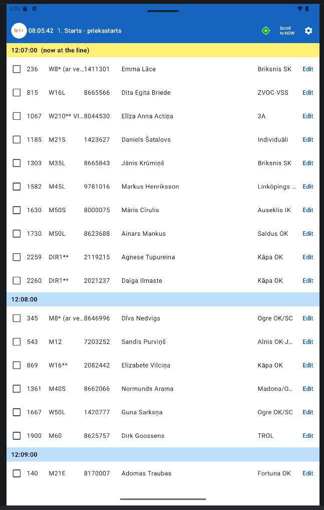
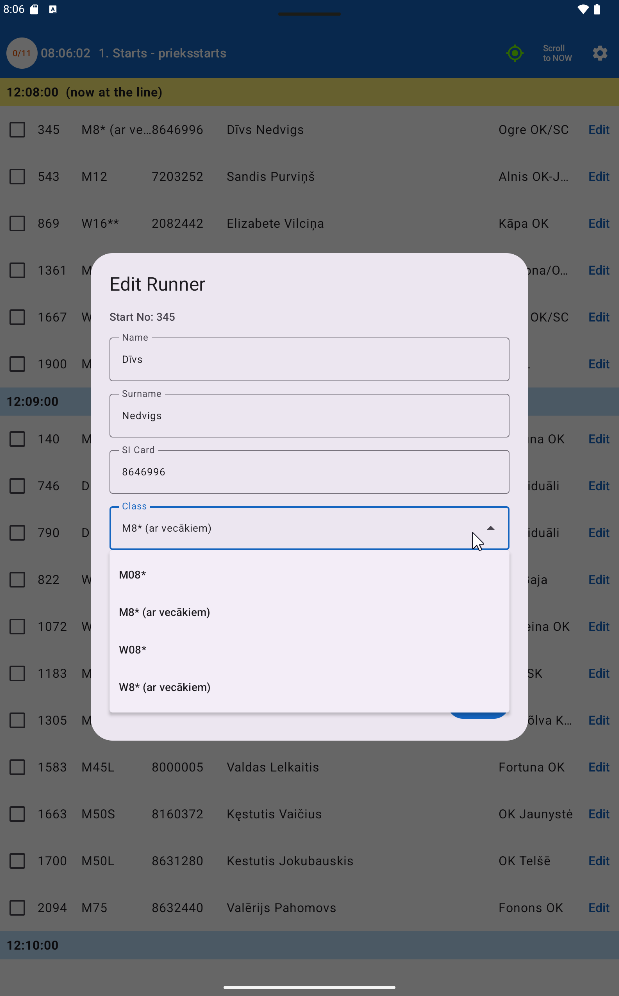
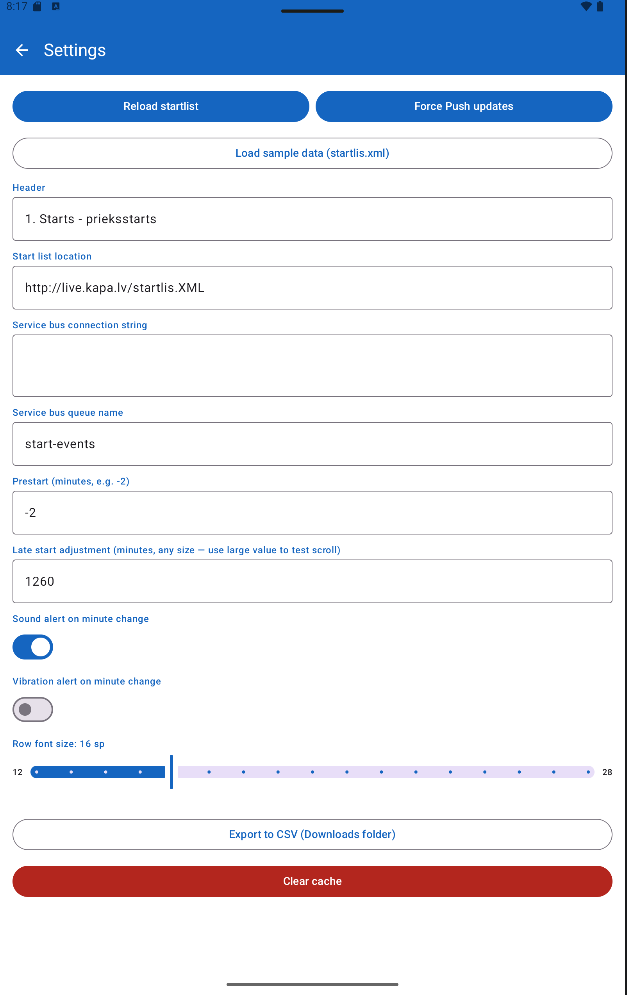

# Start Referee — Orienteering Start Management App

Android app for orienteering sport **start referees** to manage runner check-ins and status changes at the start of an event.

## Purpose

At an orienteering event, a start referee controls a start corridor where runners approach in order of their assigned start times. This app:

- Displays the full start list loaded from an IOF XML v3 file
- Lets referees check in runners (tap checkbox) or mark DNS — Did Not Start (long-press checkbox)
- Supports editing runner details (start number, class, SI card, name, club, start time)
- Highlights and scrolls to the currently active start minute, accounting for prestart and late start offsets
- Pushes all changes to an Azure Service Bus queue for downstream processing

## Business Rules

### Start List

- Loaded from a remote IOF XML v3 URL (configurable in Settings)
- On re-sync, existing local data is **merged** — checked-in runners are preserved
- The list is persisted locally; the app works offline after the first sync

### Check-in & DNS

- **Tap checkbox** → marks runner as checked in (green row background)
- **Long-press checkbox** → marks runner as DNS / Did Not Start (light red row background)
- Both events are pushed to Azure Service Bus

### "Scroll to NOW" / Auto-scroll

- The highlighted (yellow) time divider row shows the start minute currently at the line
- Calculated as: `current time − prestart offset + late start offset`
- **Prestart minutes**: how many minutes before start the runner should be at the line (e.g. −2 means the yellow row is 2 min ahead of wall-clock time)
- **Late start minutes**: global delay of the entire event (e.g. 12 means the first runner actually started 12 min late); can be set to large values (>24 h) for testing scroll behavior
- **Scroll to NOW** button: manually scrolls to the highlighted minute
- **Auto-scroll toggle** (GPS icon in toolbar): when ON, automatically scrolls to the highlighted minute at the start of every new minute

### Editing Runner Details

All fields are editable via an Edit dialog:

| Field | Notes |
|-------|-------|
| Start number | Free text |
| Class | Restricted — see class rules below |
| SI card | Numbers only, pinpad keyboard |
| Name / Club | Free text |
| Start time | Time picker + quick-set buttons (+1 min, +2 min, +3 min, +4 min from current time) |

**Class change rules:**
- Classes starting with `DIR` or `Open` (case-insensitive) can only be changed to other `DIR`/`Open` classes
- Classes starting with `M8`, `W8`, `M08`, `W08` (youth age groups, e.g. M8, W8A, M08A — but **not** M80, W80, M85, W85 which are senior age groups) can only be changed to other classes in the same youth group
- All other classes are read-only

### Sync / Azure Service Bus

- Every check-in, DNS, and runner edit is pushed automatically to an Azure Service Bus queue
- A local outbox (retry buffer) queues failed pushes; WorkManager retries in the background
- The sync counter in the top-left (e.g. `5/11`) shows published vs. total pending updates

### Settings

| Setting | Description |
|---------|-------------|
| XML URL | URL of the IOF XML v3 start list |
| Azure Service Bus connection string | Full connection string for the SB namespace |
| Azure Service Bus queue name | Target queue name |
| Event header | Title shown in the app toolbar |
| Prestart minutes | Minutes before start the runner is at the line (negative = early) |
| Late start adjustment | Global delay in minutes; accepts large values for testing |
| Sound alert | Plays a tone at the start of each minute |
| Vibration alert | Vibrates at the start of each minute |
| Row font size | Adjustable 12–28 sp (default 16 sp) |
| Clear cache | Deletes all locally stored runner data |

### CSV Export

- Exports the full current local state to a `.csv` file in the device Downloads folder
- All fields included: start number, class, SI card, name, club, start time, checked-in status, DNS status

## Screenshots

### Start List


### Edit Runner (class dropdown)


### Settings


## Stack

- Kotlin + Jetpack Compose + Material 3
- Hilt (dependency injection)
- Room (local database with migrations)
- DataStore Preferences (settings persistence)
- WorkManager (background sync retries)
- OkHttp (XML download)
- Azure Service Bus REST API with SAS token authentication
- XmlPullParser for IOF XML v3 (supports `windows-1257` encoding)
- `java.time` API for all date/time handling
- MediaStore API for CSV export to Downloads

## Minimum SDK

API 26 (Android 8.0)

## Project Layout

```
app/
  src/main/
    java/com/orienteering/startref/
      data/
        local/          Room entities, DAOs, AppDatabase
        remote/         XML parser, Azure Service Bus client
        repository/     StartListRepository
        settings/       AppSettings, SettingsDataStore
      di/               Hilt modules
      ui/
        startlist/      StartListScreen, StartListViewModel, components
        edituser/       EditUserDialog
        settings/       SettingsScreen, SettingsViewModel
      worker/           SyncWorker (WorkManager)
    assets/             Bundled sample XML (startlis.xml)
    res/                Themes, strings, drawables
    AndroidManifest.xml
```

## Run

1. Open in Android Studio.
2. Sync Gradle.
3. Run `app` on emulator or device (portrait orientation).

```powershell
.\gradlew.bat assembleDebug
```

## Notes

- `local.properties` is machine-specific and ignored by git.
- A sample `startlis.xml` can be placed in the repo root; it is automatically copied to `app/src/main/assets/` by a Gradle task before each build. Use **Settings → Load sample data** to load it without a network connection.
- Build artifacts and IDE caches are excluded via `.gitignore`.
