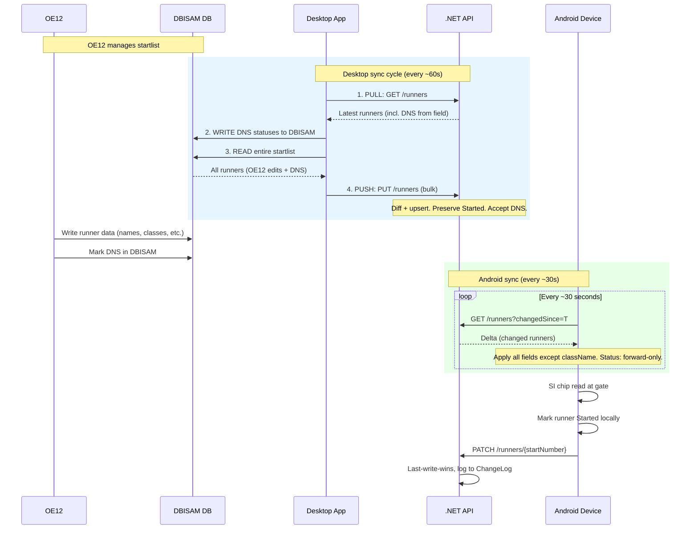

# StartRef Full Stack Architecture Plan

## Solution Structure

```
KapaStartList/
├── StartRef.sln                    (new - ties API + Desktop)
├── .gitignore                      (new - .NET + Android ignores)
├── API/
│   └── StartRef.Api/               (refactor existing)
│       ├── StartRef.Api.csproj
│       ├── Program.cs
│       ├── ApiKeyAuthMiddleware.cs  (keep, minor tweak)
│       ├── Data/
│       │   ├── AppDbContext.cs      (rewrite for Azure SQL)
│       │   ├── Entities/
│       │   │   ├── Competition.cs
│       │   │   ├── Runner.cs
│       │   │   ├── Status.cs
│       │   │   └── ChangeLogEntry.cs
│       │   └── Migrations/          (regenerate)
│       ├── Models/                   (new request/response DTOs)
│       └── Endpoints/                (new, organized by resource)
├── Desktop/
│   └── StartRef.Desktop/            (new WinForms project)
└── AndroidReferee/                   (refactor existing)
    └── app/src/main/java/com/orienteering/startref/
```

---

## Phase 1: API Refactor

### Data Model (EF Core entities → Azure SQL)

**Status** (seed data, read-only lookup):

```csharp
public class Status
{
    public int Id { get; set; }           // PK
    public string Name { get; set; }      // "Registered", "Started", "DNS"
}
```

**Competition** (auto-created on bulk upload):

```csharp
public class Competition
{
    public DateOnly Date { get; set; }           // PK
    public string? Name { get; set; }
    public DateTimeOffset CreatedAtUtc { get; set; }
}
```

**Runner**:

```csharp
public class Runner
{
    public DateOnly CompetitionDate { get; set; }  // PK composite, FK → Competition
    public int StartNumber { get; set; }           // PK composite
    public string? SiChipNo { get; set; }
    public string Name { get; set; }
    public string Surname { get; set; }
    public string ClassName { get; set; }
    public string ClubName { get; set; }
    public string? Country { get; set; }
    public int StatusId { get; set; }              // FK → Status, default 1
    public int StartPlace { get; set; }
    public DateTimeOffset LastModifiedUtc { get; set; }
    public string LastModifiedBy { get; set; }
}
// Index: (CompetitionDate, LastModifiedUtc)
```

**ChangeLogEntry** (append-only audit, no FK constraints):

```csharp
public class ChangeLogEntry
{
    public long Id { get; set; }                  // PK identity
    public DateOnly CompetitionDate { get; set; }
    public int StartNumber { get; set; }
    public string FieldName { get; set; }
    public string? OldValue { get; set; }
    public string? NewValue { get; set; }
    public DateTimeOffset ChangedAtUtc { get; set; }
    public string ChangedBy { get; set; }
}
```

### Endpoint Contracts

All non-GET endpoints require `X-Api-Key` header (existing middleware, unchanged).

#### `PUT /api/competitions/{date}/runners` — Bulk upload (Desktop)

- Auto-creates Competition row if not exists for `{date}`.
- Upserts all runners. For each incoming runner, compares field-by-field against DB:
  - New startNumber → INSERT, log all fields to ChangeLog.
  - Existing runner, field differs → UPDATE that field only, log to ChangeLog.
  - **StatusId rules:** Desktop can send `statusId=1` (Registered) or `statusId=3` (DNS, from OE12).
    - Desktop sends DNS (3), server has Registered (1) → **apply DNS**
    - Desktop sends DNS (3), server has Started (2) → **apply DNS** (DNS wins over Started)
    - Desktop sends Registered (1), server has Started (2) → **keep Started** (never downgrade)
    - Desktop sends Registered (1), server has DNS (3) → **keep DNS** (never downgrade)
  - In short: Desktop can escalate status to DNS but never downgrade Started/DNS → Registered.
- Conflict resolution for non-status fields: incoming `lastModifiedUtc` vs server `LastModifiedUtc`. If server is newer, skip the field.

Request body: `{ source, lastModifiedUtc, runners[] }` — single timestamp for entire batch (DBISAM has no per-row timestamps). Each runner includes `statusId` (1 or 3, as read from DBISAM).

For **Force Push All**: Desktop sends the same request but with `lastModifiedUtc` set to `DateTimeOffset.UtcNow`. Since the timestamp is guaranteed to be newer than anything on the server, all non-status fields will be accepted and overwritten. Status rules still apply (never downgrade Started/DNS → Registered).

Response: `{ competitionDate, competitionCreated, inserted, updated, unchanged, skippedAsOlder }`.

#### `PATCH /api/competitions/{date}/runners/{startNumber}` — Partial update (Android)

- Only updates fields present in request body.
- `**className` is rejected / ignored** — class is immutable after initial upload. API silently ignores it if present.
- Last-write-wins per-row: reject if incoming `lastModifiedUtc` < server `LastModifiedUtc`.
- Logs each changed field to ChangeLog.

Request body: `{ statusId?, siChipNo?, name?, surname?, clubName?, country?, startPlace?, lastModifiedUtc, source }` (no className).

Response: `{ startNumber, applied, reason?, serverLastModifiedUtc? }`.

#### `GET /api/competitions/{date}/runners[?changedSince=ISO]` — Full or delta

- Without `changedSince`: all runners for that date.
- With `changedSince`: only `WHERE LastModifiedUtc > @changedSince`.
- Returns `serverTimeUtc` — client stores this for next poll.
- Includes `statusName` alongside `statusId` to avoid extra lookup calls.

#### `GET /api/competitions/{date}/changelog[?max=100&startNumber=N]`

Audit log, newest first.

#### `GET /api/statuses` — Status lookup

#### `GET /api/competitions` — List competitions (most recent first)

#### `DELETE /api/competitions/{date}/runners` — Clear startlist for a date

### Infrastructure

- Switch EF Core provider: `Microsoft.EntityFrameworkCore.Sqlite` → `Microsoft.EntityFrameworkCore.SqlServer`.
- Connection string: Azure SQL serverless (`appsettings.json`, override via App Service config).
- Add `Microsoft.AspNetCore.ResponseCompression` middleware (`app.UseResponseCompression()` with gzip+brotli).
- Seed Status table in migration with HasData.

---

## Phase 2: Android Refactor

### Room DB Migration (v2 → v3)

Update `RunnerEntity`:

- Remove `checkedIn: Boolean` and `dns: Boolean`.
- Add `statusId: Int` (default 1), `country: String`, `startPlace: Int`.
- Keep `checkedInAt` (renamed conceptually to "status changed at" but column name stays for simplicity).

Migration SQL:

```sql
ALTER TABLE runners ADD COLUMN statusId INTEGER NOT NULL DEFAULT 1;
ALTER TABLE runners ADD COLUMN country TEXT NOT NULL DEFAULT '';
ALTER TABLE runners ADD COLUMN startPlace INTEGER NOT NULL DEFAULT 0;
UPDATE runners SET statusId = 2 WHERE checkedIn = 1;
UPDATE runners SET statusId = 3 WHERE dns = 1;
-- keep checkedIn/dns columns for now (Room won't read them if not in entity)
```

### API Client Refactor

Replace current message-posting `ApiClient` with:

- `patchRunner(date, startNumber, fields, lastModifiedUtc, source)` → `PATCH`
- `getRunners(date, changedSince?)` → `GET` (delta or full)
- `getStatuses()` → `GET /api/statuses`

### Sync Service (new)

Background coroutine in ViewModel or a dedicated `SyncManager`:

- Every ~30 seconds: `GET /competitions/{today}/runners?changedSince={lastServerTimeUtc}`.
- Merge response into Room DB.
- **Fields applied from server:** name, surname, siChipNo, clubName, country, startPlace, statusId.
- **Fields NEVER updated from server:** `className` — class is immutable once set; no app (Android, Desktop, API) can change it after initial upload.
- **Status merge rule — forward-only transitions:**
  - Server=Started, Local=Registered → **apply Started**
  - Server=DNS, Local=Registered → **apply DNS**
  - Server=DNS, Local=Started → **apply DNS**
  - Server=Registered, Local=Started → **keep local** (never downgrade)
  - Server=Registered, Local=DNS → **keep local** (never downgrade)
- Store `serverTimeUtc` from response in DataStore for next poll.

### Pending Sync Queue (refactor existing)

Keep `PendingSyncEntity` + `PendingSyncWorker` pattern but change payload from raw JSON messages to structured patch calls. On failure, retry via WorkManager.

### Gate Screen (new)

New navigation route: `"gate"`. Bottom navigation or tab to switch between "Start List" (referee view) and "Gate" (SI reader view).

#### Gate Screen UI

```
┌──────────────────────────────────┐
│  ██ 10:32:00 ██                  │  ← Time field, background = signal color
│                                  │     (white=idle, bright_green=just matched,
│                                  │      green=matched, orange=wrong minute,
│                                  │      red=not found)
├──────────────────────────────────┤
│  Runners starting at 10:32      │
│  ┌────────────────────────────┐  │
│  │ 101  Jānis Bērziņš  M21E  │  │  ← uncolored initially
│  │ 102  Anna Liepa     W21E  │  │     green background after SI read OK
│  │ 103  Pēteris Ozols  M21E  │  │     tappable (to assign chip on RED)
│  └────────────────────────────┘  │
├──────────────────────────────────┤
│  [ Handle Manually ]             │  ← visible only on RED/ORANGE state
│                                  │
│  Last read: SI 8001234 → #101 OK │  ← status line
└──────────────────────────────────┘
```

#### Gate Color Logic


| Scenario                                               | Time field color                       | Action                                                              |
| ------------------------------------------------------ | -------------------------------------- | ------------------------------------------------------------------- |
| Idle (no recent read)                                  | White/default                          | —                                                                   |
| Chip matches runner in current minute                  | Bright green → fades to green after 2s | Auto-mark runner as Started (`statusId=2`), queue PATCH             |
| Chip matches runner within ±5 min (not current minute) | Orange                                 | Show runner name + "Approve" / "Handle Manually" menu               |
| Chip not found in startlist                            | Red                                    | Tap a runner in current minute to assign chip, OR "Handle Manually" |
| "Approve" tapped (orange)                              | Green                                  | Mark that runner as Started, queue PATCH                            |
| "Handle Manually" tapped                               | Reset to white                         | Log event locally, no status change                                 |


#### USB OTG SI Station Integration

- Library: [usb-serial-for-android](https://github.com/mik3y/usb-serial-for-android) for USB serial communication.
- SportIdent stations (BSM-7/8) use serial protocol at 38400 baud.
- New module: `data/si/SiStationReader.kt` — connects to USB device, listens for card-insert events, extracts SI card number.
- Lifecycle: start listening when Gate screen is active, stop when navigated away.
- Permissions: USB host permission via `intent-filter` in AndroidManifest + runtime permission dialog.

---

## Phase 3: Desktop App (new WinForms project)

### Project Setup

- `Desktop/StartRef.Desktop/StartRef.Desktop.csproj` — .NET 8 WinForms, targets `net8.0-windows`.
- Add to `StartRef.sln` alongside the API project.

### Components

- `**DbIsamReader.cs**` — reads entire startlist from DBISAM using the user's existing driver. Returns `List<RunnerDto>`.
- `**DbIsamWriter.cs**` — writes DNS statuses back to DBISAM. Only updates the status/DNS field for runners where the API reports DNS.
- `**ApiClient.cs**` — HTTP client for:
  - `PUT /competitions/{date}/runners` (bulk upload)
  - `GET /competitions/{date}/runners` (pull latest state, with optional `changedSince`)
- `**SyncService.cs**` — `System.Windows.Forms.Timer`-based bidirectional sync. Configurable interval (default: every 60s). Each cycle:
  1. **PULL**: `GET /runners` from API → get latest state (statuses from field devices)
  2. **WRITE DNS to DBISAM**: for any runner where API has `statusId=3` (DNS), update DBISAM so OE12 sees it. (Started status is NOT written to DBISAM — only DNS matters for OE12.)
  3. **READ from DBISAM**: get full startlist (includes OE12 edits + DNS just written)
  4. **PUSH to API**: bulk upload, API diffs. Status rules: accept DNS from DBISAM, never downgrade Started/DNS → Registered.
- `**Settings`** — stored in user-scoped settings or a local JSON file: API base URL, API key (editable in UI), sync interval, DBISAM path.

### Main Form UI

```
┌─ StartRef Desktop ───────────────────────────────────┐
│  API: https://startref.azurewebsites.net      [Edit] │
│  Key: ●●●●●●●●                                [Edit] │
│  DB Path: C:\OE12\data\...                   [Browse]│
│  Competition: 2026-03-28 (198 runners)               │
│                                                       │
│  Auto-sync: [v] Enabled   Interval: [60s]            │
│  Last sync: 09:32:15                                  │
│                                                       │
│  [ Sync Now ]    [ Force Push All ]                   │
│                                                       │
│  Status: Idle                                         │
│  ┌─ Log ──────────────────────────────────────────┐   │
│  │ 09:32:15 PUSH #101 Jānis Bērziņš – SiChipNo   │   │
│  │          changed "8001234"→"8009999"            │   │
│  │ 09:32:15 PUSH #55 Anna Liepa – new runner      │   │
│  │ 09:32:14 PULL #203 Pēteris Ozols – Status      │   │
│  │          changed "Registered"→"DNS"             │   │
│  │          (by: android-gate1)                    │   │
│  │ 09:32:14 DBISAM WRITE DNS: #203 Pēteris Ozols  │   │
│  │ 09:31:00 Auto-sync: no changes                  │   │
│  └────────────────────────────────────────────────┘   │
└───────────────────────────────────────────────────────┘
```

**Buttons:**

- **Sync Now** — runs the normal sync cycle immediately (PULL → WRITE DNS → READ DBISAM → PUSH). Same as auto-sync but manually triggered.
- **Force Push All** — reads entire DBISAM startlist and uploads with `lastModifiedUtc` set to NOW, so all non-status fields overwrite whatever is on the server. Statuses are still protected (API never downgrades Started/DNS → Registered). Use case: OE12 data has been corrected and you want to force the server to accept all current DBISAM values.

**Log details:**

- Each changed runner is logged with start number, full name, field changed, old → new value.
- PULL entries include which device (`lastModifiedBy`) made the change.
- Log is displayed in the UI ListBox/TextBox AND simultaneously appended to `sync_log.txt` in the same directory as the executable.

---

## Sync Flow Summary




---

## Key Design Decisions Recap


| Decision              | Choice                                                                                                                                                          |
| --------------------- | --------------------------------------------------------------------------------------------------------------------------------------------------------------- |
| Source of truth       | API database (Azure SQL)                                                                                                                                        |
| Conflict resolution   | Last-write-wins per-row via `LastModifiedUtc`                                                                                                                   |
| Desktop ↔ API         | Bidirectional: PULL (get DNS from field) → WRITE DNS to DBISAM → READ DBISAM → PUSH to API                                                                      |
| API → Android         | Delta sync via `changedSince` poll every ~30s. Apply all fields except className. Status: forward-only (Started + DNS accepted, never downgrade to Registered). |
| Android → API         | PATCH with only changed fields (never className). Can set Started and DNS.                                                                                      |
| Desktop → API status  | Can escalate to DNS (from OE12). Never downgrades Started/DNS → Registered.                                                                                     |
| className             | Immutable after initial bulk upload INSERT. No app can change it via PATCH or subsequent uploads.                                                               |
| DNS sources           | Both OE12 (via DBISAM → Desktop → API) and Android referees (PATCH → API)                                                                                       |
| Real-time push        | None (no SignalR). HTTP polling only                                                                                                                            |
| Competition lifecycle | Auto-created on first bulk upload for a date                                                                                                                    |
| Auth                  | `X-Api-Key` header on mutations; GETs open                                                                                                                      |
| SI reader             | USB OTG serial to SportIdent station                                                                                                                            |


